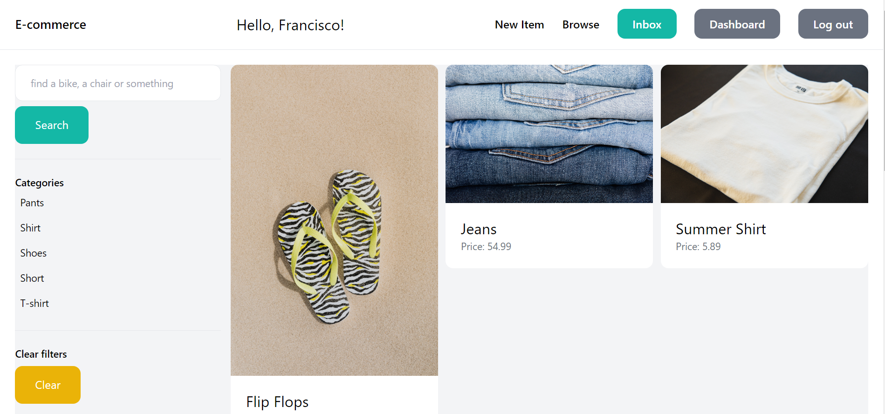
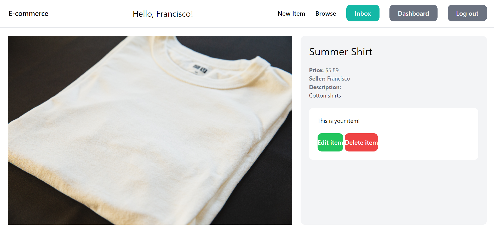

# E-Commerce App (Django)

   Welcome to the E-Commerce App repository! This web application was built with Django as part of my learning journey. I created it in December 2022, following the instructions of a course on FreeCode Camp. Through this project, I aimed to grasp the philosophy of Django and understand the roles of essential files like `settings.py`, `views.py`, `urls.py`, and `models.py`.

## Why Django?

Having prior experience with Flask, I found Django to be a more user-friendly framework for web development. Django manages a significant portion of the backend structure, making it easier to build projects without worrying about security, routing connections, and more. The ability to reuse code also contributes to faster and more scalable development.

## Features

**The E-Commerce App allows users to:**

      (*Users can edit or delete they on item*)
- View items on the landing page
- Register and login to post or send messages to other users
- Post items for sale
- Send and answer messages to other users

## Requirements

- Python 3.10 or later
- Django

## Installation

1. Clone the repository:
`git clone https://github.com/CiscoMerchan/E-Commerce_app_Django.git`

2. Create a virtual environment and activate it. You can follow these steps
   For Windows:
   `> python -m venv venv
    > venv\Scripts\activate`
   
   For macOS/Linux:
   `> python3 -m venv venv
    > source venv/bin/activate`

3. Install the required packages:

  `pip install -r requirements.txt`

## Usage
Open terminal

1. Navigate to the `ecommerce` directory: `cd ecommerce`
  
2. Run the app on your localhost:
   `python manage.py runserver`

3. Access the app in your web browser using the provided local URL (usually `http://127.0.0.1:8000/`).

## Get Started

Feel free to explore the E-Commerce App, interact with its features, and experiment with the functionalities. If you encounter any issues or have suggestions for improvements, please don't hesitate to open an issue on this repository.

Happy learning and developing!

  
 

